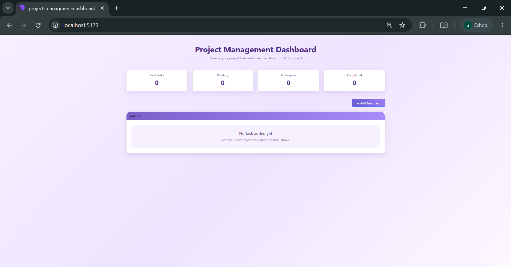
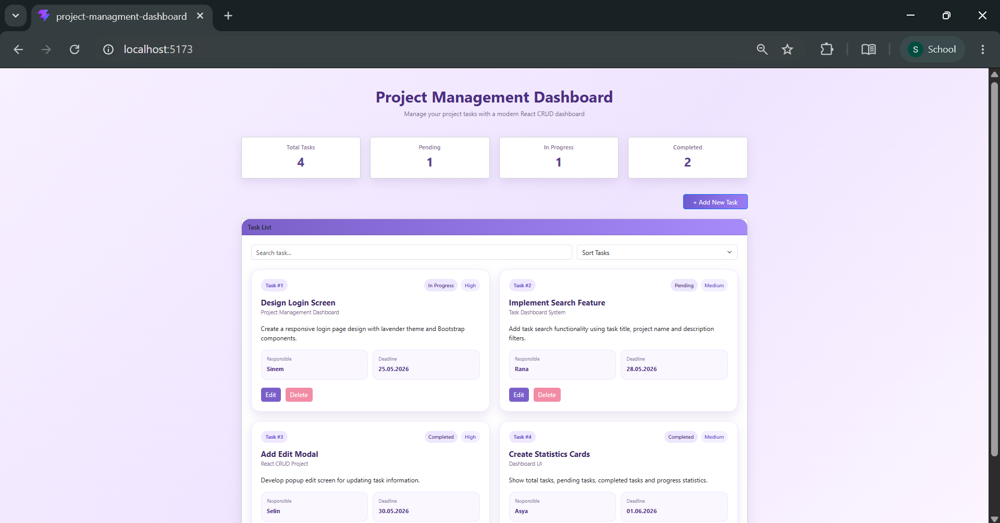
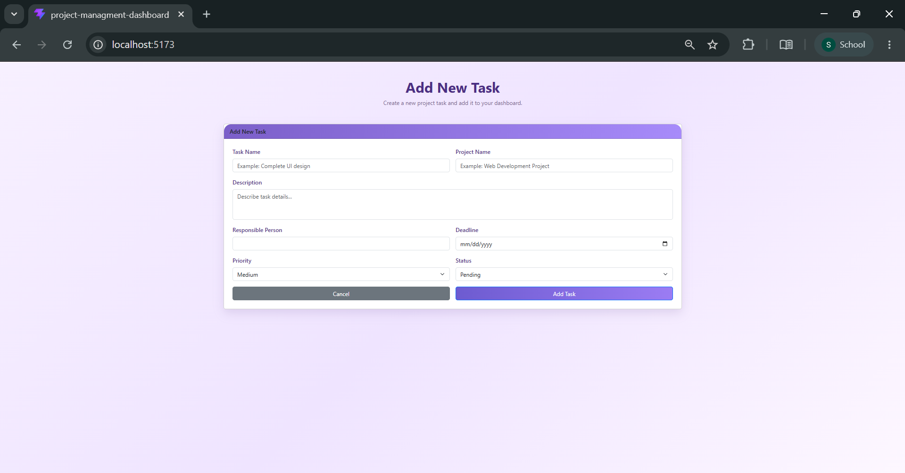
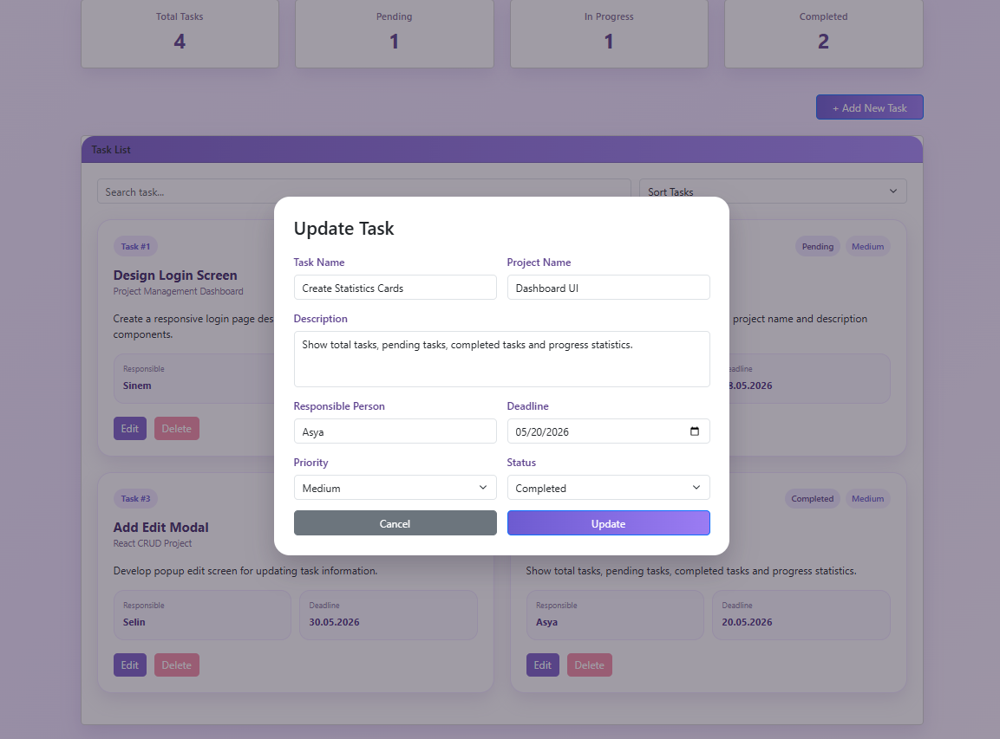
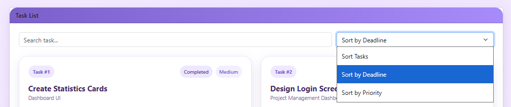

# Project Management Dashboard

Bu proje, Web Geliştirme – JavaScript eğitimi kapsamında geliştirilmiş modern bir görev yönetim uygulamasıdır. Proje ReactJS kullanılarak geliştirilmiş olup görevlerin eklenmesi, görüntülenmesi, güncellenmesi ve silinmesi işlemlerini desteklemektedir.

Uygulama modern dashboard yapısına sahiptir ve LocalStorage desteği sayesinde sayfa yenilense bile veriler korunmaktadır.

---

# Canlı Yayın Linki (Netlify)

Proje yayını:

https://startling-capybara-6fde54.netlify.app/

---

# GitHub Proje Linki

GitHub deposu:

https://github.com/sinemtasdemir19/project-management-dashboard

---

# 🎯 Proje Amacı

Bu proje ile ReactJS kullanılarak modern bir görev yönetim sistemi geliştirilmesi amaçlanmıştır.

Proje kapsamında:

- React component yapısı
- Sayfa organizasyonu
- Interface yapısı kullanımı
- CRUD işlemleri
- State yönetimi
- LocalStorage kullanımı
- Responsive arayüz tasarımı
- Dashboard geliştirme

konuları uygulanmıştır.

---

# Kullanılan Teknolojiler

Projede modern frontend geliştirme araçları ve web teknolojileri kullanılmıştır.

### ReactJS
Projenin kullanıcı arayüzü ReactJS kullanılarak geliştirilmiştir. Bileşen (component) yapısı sayesinde uygulama daha modüler ve yönetilebilir hâle getirilmiştir.

### JavaScript (ES6+)
Uygulamanın temel iş mantığı JavaScript kullanılarak geliştirilmiştir. State yönetimi, CRUD işlemleri, filtreleme, sıralama ve LocalStorage işlemleri JavaScript ile gerçekleştirilmiştir.

### Vite
React projesinin oluşturulması ve geliştirme ortamının hazırlanması için Vite kullanılmıştır. Vite hızlı geliştirme ortamı ve build işlemleri sağlamaktadır.

### Bootstrap 5
Responsive tasarım ve hazır arayüz bileşenleri için Bootstrap 5 kullanılmıştır.

Bootstrap aşağıdaki alanlarda kullanılmıştır:

- Grid sistemi (container, row, col)
- Kart yapıları
- Form elemanları
- Butonlar
- Responsive görünüm
- Margin ve padding düzenleri

### CSS
Projeye özel görsel tasarım oluşturmak amacıyla CSS kullanılmıştır.

### LocalStorage
Görev verilerinin tarayıcı üzerinde saklanabilmesi için LocalStorage kullanılmıştır.

### Git
Versiyon kontrol sistemi olarak Git kullanılmıştır. Geliştirme sürecinde commit işlemleri ile proje aşamaları takip edilmiştir.

### GitHub
Proje dosyaları GitHub üzerinde public depo olarak paylaşılmıştır ve sürüm takibi yapılmıştır.

### Netlify
Projenin canlı ortamda yayınlanması için Netlify kullanılmıştır.

---

# 📂 Proje Klasör Yapısı

```text
src
│
├── components
│   ├── TaskForm.jsx
│   ├── TaskList.jsx
│   └── EditTaskModal.jsx
│
├── pages
│   ├── Home.jsx
│   └── AddTaskPage.jsx
│
├── interfaces
│   └── TaskInterface.js
│
├── App.jsx
├── main.jsx
└── index.css
```

Proje içerisinde bileşen (components), sayfa (pages) ve veri modeli (interfaces) yapıları kullanılarak daha düzenli ve yönetilebilir bir mimari oluşturulmuştur.

Interfaces klasörü içerisinde görev nesnesi için varsayılan yapı tanımlanmıştır ve form işlemlerinde kullanılmıştır.

Proje içerisinde bileşen yapısı kullanılarak daha düzenli ve yönetilebilir bir yapı oluşturulmuştur.

---

# Proje Özellikleri

## CRUD İşlemleri

### Görev Ekleme

Kullanıcı yeni görev oluşturabilmektedir.

Eklenen bilgiler:

- Görev adı
- Proje adı
- Açıklama
- Sorumlu kişi
- Teslim tarihi
- Öncelik seviyesi
- Durum bilgisi

Görev oluşturulduktan sonra kullanıcı ana sayfaya yönlendirilmektedir.

---

### Görev Listeleme

Eklenen görevler dashboard ekranında kart yapısı ile görüntülenmektedir.

Kart içerisinde:

- Görev numarası
- Görev adı
- Proje bilgisi
- Açıklama
- Sorumlu kişi
- Tarih
- Durum
- Öncelik seviyesi

yer almaktadır.

---

### Görev Güncelleme

Görev kartları üzerindeki **Edit** butonu kullanılarak popup pencere açılmaktadır.

Popup ekranı üzerinden:

- Görev bilgileri değiştirilebilir
- Açıklama düzenlenebilir
- Durum değiştirilebilir
- Öncelik seviyesi güncellenebilir

---

### Görev Silme

Delete butonu ile görev sistemden kaldırılabilmektedir.

Silinen görevler LocalStorage içerisinden de silinmektedir.

---

# Ek Özellikler

Projeye temel CRUD yapısına ek olarak aşağıdaki özellikler eklenmiştir:

✅ Görev arama sistemi

Görevler:

- Görev adına göre
- Proje adına göre
- Açıklamaya göre
- Sorumlu kişiye göre

aranabilmektedir.

---

✅ Görev sıralama sistemi

Sıralama seçenekleri:

- Tarihe göre sıralama
- Önceliğe göre sıralama

Öncelik sırası:

High → Medium → Low

---

✅ Dashboard kartları

Ana sayfada istatistik kartları bulunmaktadır:

- Total Tasks
- Pending
- In Progress
- Completed

---

✅ Modern kullanıcı arayüzü

Projede:

- Lavanta teması
- Kart tasarımı
- Responsive yapı
- Soft renkler
- Badge kullanımı

uygulanmıştır.

---

# LocalStorage Kullanımı

Projede LocalStorage kullanılmıştır.

Bu yapı sayesinde:

- Sayfa yenilendiğinde veriler silinmez
- Tarayıcı kapatılsa bile görevler korunur
- Yeni görevler otomatik kaydedilir
- Güncelleme işlemleri otomatik saklanır
- Silinen kayıtlar otomatik kaldırılır

---

# Ekran Görüntüleri

## Ana Sayfa – Boş Dashboard

<p align="center">

</p>

---

## Ana Sayfa – Görevler Eklenmiş Hali

<p align="center">

</p>

---

## Görev Ekleme Sayfası

<p align="center">

</p>

---

## Görev Düzenleme Popup Ekranı

<p align="center">

</p>

---

## Arama ve Sıralama Özellikleri

<p align="center">

</p>


